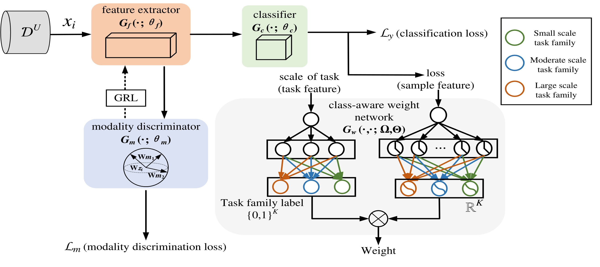

# CASWL-Adapt (ECAI 2024)
This is the official repository for our paper: Class-Aware Sample Weight Learning for Cross-Modal Unsupervised Domain Adaptation in Cross-User Wearable Human Activity Recognition. （Only the unimodal version has been released and will continue to update the remainder in the future.）



## Dependencies
* python 3.7
* torch == 1.8.0 (with suitable CUDA and CuDNN version)
* higher (https://pypi.org/project/higher/)
* numpy, torchmetrics, scipy, pandas, argparse, sklearn

## Datasets

| Dataset | Download Link |
| -- | -- |
| RealWorld | https://www.uni-mannheim.de/dws/research/projects/activity-recognition/dataset/dataset-realworld/ |
| OPPORTUNITY | https://archive.ics.uci.edu/ml/datasets/opportunity+activity+recognition |
| SBHAR | http://archive.ics.uci.edu/ml/datasets/Smartphone-Based+Recognition+of+Human+Activities+and+Postural+Transitions |

## Quick Start

Data preprocessing is included in main.py. Download the datasets and run CASWL-Adapt as follows. This gives the performance of each evaluation with each user in the set of new users as the new user, and their average.
```
python main.py --data_path [/path/to/dataset] --dataset [realWorld, OPPORTUNITY, or PAMAP2] 
```

## Reference

Our model is built from the following papers:
```
@inproceedings{
    title={SWL-Adapt: An unsupervised domain adaptation model with sample weight learning for cross-user wearable human activity recognition},
    author={Rong Hu and Ling Chen and Shenghuan Miao and Xing Tang},
    booktitle={Proceedings of the AAAI Conference on Artificial IntelligenceThirty-seventh Conference on Neural Information Processing Systems Datasets and Benchmarks Track},
    year={2023},
    url={https://ojs.aaai.org/index.php/AAAI/article/view/25743}
}
@Journal{
    title={CMW-Net: Learning a Class-Aware Sample Weighting Mapping for Robust Deep Learning},
    author={Jun Shu and Xiang Yuan and Deyu Meng and Zongben Xu},
    booktitle={IEEE Transactions on Pattern Analysis and Machine Intelligence},
    year={2023},
    url={https://ieeexplore.ieee.org/abstract/document/10113668}
}

```
